# Chronicle Forge — Architecture

Chronicle Forge is a 6-step pipeline that takes a topic and target duration and produces a narrated YouTube story video (1920×1080 MP4 + metadata). Each step is an independent Python module; state is checkpointed to `output/video_data.json` after every LLM step so the pipeline can resume from any point.

---

## Pipeline Flowchart

```mermaid
flowchart TD
    A([User: topic + duration]) --> B

    subgraph step1 ["[1] research_gen.py — Wikipedia Research"]
        B[Search Wikipedia: top 3 results] --> C[Fetch intro extract per page\nmax 3 000 chars each]
        C --> D[Return summary + source URLs]
    end

    subgraph step2 ["[2] script_gen.py — Story Script  ← 3 LLM passes"]
        D --> E["Pass 1: Story Narration\nOllama streaming · 600s wall-clock\nStory arc · protagonist · tension\nFull name expansion · no phonetics\n2.5 wps × duration"]
        E --> |"checkpoint saved after Pass 1"| F["Pass 2: Scene Breakdown + Image Prompts  COMBINED\nOllama streaming · 600s wall-clock\nLLM is film director + cinematographer:\ncuts at visual transitions AND writes 40-60 word\ncinematic prompts in the same reasoning pass\nOutput: [{text_segment, prompt}]"]
        F --> G["Pass 3: SSML Annotation\nOllama streaming · 300s wall-clock\nAdds emphasis · break · prosody tags\nXML validation → fallback to plain text"]
        G --> H[Clamp to MAX_SCENES = 80\nAuto-split fallback if JSON fails]
    end

    subgraph step3 ["[3] meta_gen.py — YouTube Metadata"]
        H --> I[Step 3a: Title\nOllama · 300s\nOne focused call → single line]
        I --> J[Step 3b: Description\nOllama · 600s\n250–300 word structured description]
        J --> K[Step 3c: Tags\nOllama · 180s\nJSON array of 15 tags]
        K --> L[Each sub-call has independent fallback]
    end

    subgraph step4 ["[4] tts_gen.py — TTS Audio  ← uses SSML"]
        L --> M["edge-tts async stream\nInput: narration_ssml or narration\nStrips outer speak wrapper if present\nOutputs MP3 + word-boundary events\n100-ns units → ms conversion"]
    end

    subgraph step5 ["[5] image_gen.py — SDXL Images"]
        M --> N[Load Juggernaut XL\nUNet → DirectML\nVAE + text encoders → CPU]
        N --> O[4 DML patches applied\nbridge + time_proj + time_embedding + add_embedding]
        O --> P[prepare_latents override\nForce CPU latents for scheduler compatibility]
        P --> Q["Per-scene: encode_prompt CPU\n→ pipe diffuse DML  (scene prompt → CLIP ViT-L)\n→ ILLUS_STYLE → OpenCLIP ViT-bigG\n→ VAE decode CPU\n→ PNG 1216×832"]
    end

    subgraph step6 ["[6] video_composer.py — Final Video"]
        Q --> R[assign_scene_timestamps\nMatch text_segment first 3 words\n→ TTS word offset_ms]
        R --> S[Ken Burns zoom-out per clip\nMoviePy + OpenCV · 0.25s crossfades\n1920×1080 @ 24fps]
        S --> T[AudioFileClip sync\nlibx264 + aac MP4]
    end

    T --> U([output/final_video.mp4\n+ output/video_data.json\n+ YouTube metadata printed])
```



---

## Key Architectural Changes (v2)

| What changed | Before | After |
|---|---|---|
| **Script tone** | Documentary ("In 3000 BCE...") | Story with protagonist, tension, emotional arc |
| **Name expansion** | Phonetic hyphens ("Too-TANK-ah-mun") | Full names ("Ramesses the Second"), no phonetics |
| **Scene + prompt agent** | Two separate LLM calls (script_gen → prompt_gen) | One combined call: film director decides cuts AND writes prompts simultaneously |
| **prompt_gen.py** | Active pipeline step (visual world definition + batched prompts) | Dead code — no longer invoked from main.py |
| **Image prompt length** | 8–12 word visual_subject | 40–60 word cinematic prompt with subject/environment/lighting/angle/mood |
| **TTS markup** | Plain text | SSML-annotated: `<emphasis>`, `<break>`, `<prosody>` for emotional delivery |
| **Pipeline steps** | 7 (including separate prompt step) | 6 (script step contains all 3 passes) |
| **Checkpoint granularity** | After Pass 2 only | After Pass 1 (narration) AND after Pass 2+3 |

---

## Module Descriptions

### `research_gen.py` — Wikipedia Research

| | |
|---|---|
| **Input** | `topic: str` |
| **Output** | `{summary: str, sources: [{title, url}]}` |
| **External** | Wikipedia REST API (`/api.php`) |

Searches Wikipedia for the topic and fetches intro extracts from the top 3 results. Truncates each extract to 3 000 characters to keep the LLM context affordable. Returns a concatenated `summary` string (used as research context in script generation) and a `sources` list (embedded in the YouTube description).

Uses a descriptive `User-Agent` header (`chronicle-forge/1.0 …`) as required by Wikimedia policy — omitting it returns 403.

---

### `script_gen.py` — Story Script (3 passes)

| | |
|---|---|
| **Input** | `topic`, `target_seconds`, `research_summary` |
| **Output** | `narration: str`, `scenes: [{text_segment, prompt}]`, `narration_ssml: str` |
| **Model** | `nemotron-3-super:cloud` (Ollama) |
| **Scene count** | LLM-decided, bounded by `MIN_SCENE_DURATION=4s` / `MAX_SCENE_DURATION=12s` / `MAX_SCENES=80` |

**Three-pass design.** Each pass is checkpointed separately so a failure in Pass 2 or 3 doesn't lose the narration (which takes the longest to generate).

#### Pass 1 — Story Narration

```
Write a {target_words}-word STORY narration for a YouTube video about: "{topic}"

Key facts to incorporate:
{research[:1500]}

This is a STORY, not a documentary. Make the viewer feel something:
- Open with a gripping scene, a question, or a moment of tension — hook immediately
- Give the story a protagonist (key person, civilisation, or idea itself) with stakes
- Build tension: what stood in the way? What was at risk? What could go wrong?
- Use curiosity and wonder: 'But nobody knew...', 'What happened next changed everything...'
- Emotional beats: awe, dread, urgency, triumph, tragedy — the viewer must FEEL it
- Vary tone: tense opening, rising stakes, shocking reveal, resonant ending
- Short punchy sentences for impact; longer flowing ones for atmosphere
- Each sentence max 18 words — must sound natural when spoken aloud
- Spell all numbers as words: 'three thousand years ago', not '3,000 years ago'
- Write full names — expand all initials: 'Robert Jay Oppenheimer', not 'Robert J. Oppenheimer'
- Never use phonetic respellings — write names naturally
- No dialogue, no citations, no headings, no bullet points

Output ONLY the narration text. No title, no JSON, no commentary.
```

Wall-clock timeout: 600s. Checkpointed to `video_data.json` immediately on completion.

#### Pass 2 — Scene Breakdown + Image Prompts (combined)

The scene breakdown and image prompt generation happen in **one LLM call**. Running both together means the reasoning that determines a cut (e.g. "this is where we reveal the scale of the explosion") directly shapes the image brief for that scene — no context is lost between two separate calls.

```
You are a film director and cinematographer creating a visual story video.

STORY NARRATION ({word_count} words):
{narration}

TASK: Break the narration into visual scenes. For each scene you will:
  1. Identify the CUT POINT — where does the image need to change?
  2. Write the IMAGE PROMPT — describe exactly what to show on screen

CUT POINT RULES — place a cut where the visual subject changes:
  - New location or setting
  - New character enters or the narrative focus shifts
  - A new action or event begins
  - Time jump (hours, years, centuries pass)
  - Emotional shift: tension peaks, revelation lands, relief arrives
  - Scale change: individual → crowd, object → map, person → cosmos

IMAGE PROMPT RULES:
  - 40–60 words per prompt — specific, cinematic, concrete
  - Format: [subject + action], [environment/setting], [lighting], [camera angle], [emotional tone]
  - GOOD: 'Robert Oppenheimer stands alone on scorched desert sand at pre-dawn, Trinity test tower
    a silhouette kilometres away, long shadows toward camera, low wide-angle shot,
    crushing silence before the detonation'
  - BAD: 'scientist in desert' — far too vague for an image generator
  - Reference the actual story event — the image should tell the specific moment
  - Vary shot types: wide establishing early, medium action mid-story, close emotional at reveals
  - No art-style words ('flat', 'vector', 'illustration', 'cartoon', 'Kurzgesagt')

CONSTRAINTS:
  - Produce between {min_scenes} and {max_scenes} scenes; favour {max_scenes}
  - text_segment: VERBATIM words from the narration — never paraphrase or summarise
  - Every single word of the narration must appear in exactly one scene

Reply with ONLY valid JSON — no markdown, no explanation:
{"scenes": [{"text_segment": "...", "prompt": "..."}]}
```

`min_scenes = max(3, target_seconds // 12)` · `max_scenes = min(80, target_seconds // 4)`

**Why combined?** `prompt_gen.py`'s visual world definition helped individual prompt quality but introduced a full extra LLM call and broke the director's unified reasoning about each cut. The combined call is faster, more coherent, and the 40-60 word prompt constraint makes a visual world preamble unnecessary.

#### Pass 3 — SSML Annotation

Adds emotional delivery markup that edge-tts interprets. The LLM is asked to annotate, not rewrite.

```
Add SSML emotional markup to this narration for Microsoft Azure neural TTS.

NARRATION:
{narration}

Make it sound like a passionate, emotional human storyteller — not a robot.

AVAILABLE TAGS:
  <emphasis level="strong">word</emphasis>       — stress one key word
  <emphasis level="moderate">phrase</emphasis>   — mild extra weight on a phrase
  <break time="500ms"/>                          — dramatic pause before a reveal
  <break time="300ms"/>                          — brief pause for breath/rhythm
  <prosody rate="slow">text</prosody>            — slow down for gravity or weight
  <prosody rate="fast">text</prosody>            — speed up for tension or urgency
  <prosody pitch="+2st">text</prosody>           — lift pitch for wonder or excitement
  <prosody pitch="-1st" rate="slow">text</prosody> — low and slow for dread

RULES:
  - Use <break time="500ms"/> before major revelations and shocking facts
  - Use <prosody rate="slow"> for lines carrying heavy emotional weight
  - Use <emphasis> on the ONE word that carries most meaning per sentence — sparingly
  - Vary delivery: the whole script cannot be the same rate and pitch
  - Do NOT over-markup — silence and emphasis lose power when overused
  - NEVER change, add, delete, or paraphrase any word of the narration
  - Every original word must appear unchanged in the output

Return ONLY the marked-up narration text — no <speak> wrapper, no explanation.
```

Wall-clock timeout: 300s. XML is validated via `ET.fromstring(f"<speak>{raw}</speak>")`. On `ET.ParseError`, falls back silently to plain narration (TTS still works, just without emotional markup).

---

### `meta_gen.py` — YouTube Metadata

| | |
|---|---|
| **Input** | `topic`, `narration` (preview), `sources` list |
| **Output** | `{title: str, description: str, tags: [str]}` |
| **Model** | `nemotron-3-super:cloud` (Ollama) |

Three separate focused calls — one per output type — each with its own timeout and fallback. Originally a single combined prompt caused ~400s of thinking before producing anything.

| Call | Timeout | Fallback | Prompt goal |
|------|---------|----------|-------------|
| Title (3a) | 300s | First valid line of raw output, or `topic.title()` | One line, under 70 chars, SEO-friendly |
| Description (3b) | 600s | Short generic description string | 250–300 words: hook + bullets + sources + CTA + hashtags |
| Tags (3c) | 180s | Topic words + `["documentary", "history", "educational"]` | JSON array of 15 tags |

---

### `tts_gen.py` — Text-to-Speech

| | |
|---|---|
| **Input** | `text: str` (plain or SSML-annotated), `voice: str` |
| **Output** | `(mp3_path, [{word, offset_ms, duration_ms}])` |
| **Model** | edge-tts (Microsoft Azure Neural TTS) |

Streams audio and word-boundary events simultaneously via `edge_tts.Communicate.stream()`. Word boundary offsets are in 100-nanosecond units; dividing by 10 000 gives milliseconds.

**SSML handling:** The SSML text from Pass 3 is passed directly — edge-tts embeds the input inside its own `<voice>` element, so inline `<emphasis>`, `<break>`, `<prosody>` tags work without a `<speak>` wrapper. `_prepare_tts_text` strips any accidental outer `<speak>` tag the LLM may have emitted.

Nine curated narrator voices are exposed via `--voice NAME` in `main.py`. Voice selection happens before any LLM steps so it applies consistently on both fresh runs and resumes.

---

### `image_gen.py` — SDXL Image Generation

| | |
|---|---|
| **Input** | `scenes: [{prompt, ...}]` — prompt is the 40-60 word cinematic brief from Pass 2 |
| **Output** | `[png_paths]` (one 1216×832 PNG per scene) |
| **Model** | Juggernaut XL (SDXL) via `diffusers` + `torch-directml` |
| **Scene limit** | `MAX_SCENES = 80` (enforced upstream in `script_gen`) |

**Device layout:**
- UNet → AMD GPU via DirectML (`torch_directml.device()`)
- Text encoders + VAE → CPU (DirectML 0.2.5 doesn't support int64 embedding ops)

**DML patches** (`_patch_dml_unet`): four monkey-patches applied once at pipeline load:

| Patch | Target | Problem fixed |
|-------|--------|---------------|
| 0 (bridge) | `unet.forward` | Wraps entire forward: CPU→DML on entry, DML→CPU on exit. Fixes GroupNorm crash when `hidden_states` arrive CPU. |
| 1 | `unet.time_proj` | Forces timestep to CPU before sinusoidal embedding (int64 not supported on DML) |
| 2 | `unet.time_embedding` | Moves CPU float from time_proj back to DML before linear layers |
| 3 | `unet.add_embedding` | Moves SDXL pooled/add_embeds to DML before SDXL-specific conditioning layers |

**`prepare_latents` override:** Forces latents to CPU; the scheduler runs entirely on CPU; only UNet forward executes on DML via the bridge.

**Style split:** Scene `prompt` (from Pass 2) goes to CLIP ViT-L (what to draw). `ILLUS_STYLE` is injected via `prompt_2` (OpenCLIP ViT-bigG channel) for the illustration aesthetic. `ILLUS_NEGATIVE` blocks photorealistic, 3D, and sketchy outputs.

Output: `output/images/scene_NNN.png` at 1216×832 (upscaled to 1920×1080 in video compositor).

---

### `video_composer.py` — Video Composition

| | |
|---|---|
| **Input** | `image_paths`, `scenes` (with `start_ms`/`end_ms`), `audio_path` |
| **Output** | `output/final_video.mp4` (1920×1080 @ 24fps) |
| **Libraries** | MoviePy, OpenCV, NumPy |

**Timestamp sync.** `assign_scene_timestamps` matches the first 3 words of each scene's `text_segment` against the TTS word-boundary list. When a match is found, `start_ms = offset_ms` of that word in the audio — so each image appears on screen at the exact moment the narrator begins speaking the text it illustrates.

Each scene clip is a Ken Burns zoom-out (`START_ZOOM = 1.08 → 1.0`). Clips crossfade at 0.25s. Final audio is trimmed to match video duration.

---

## What Needs to Be Watched

### P0 — Blocking

**TTS word boundaries returning 0 events**
`tts_gen.py` may print `"TTS saved: output/narration.mp3 (0 word events)"`. When `word_boundaries` is empty, `assign_scene_timestamps` falls back to equal duration distribution — the entire TTS-image sync feature is silently disabled. With 40–80 scenes per video this fallback is very visible. To debug: log raw events in `_speak_with_boundaries` before building `boundaries`. Common causes: edge-tts version mismatch, voice not supporting `WordBoundary` events. Check: `asyncio.run(edge_tts.list_voices())` then test with a 2-sentence string.

---

### P1 — Significant Impact

**Juggernaut XL is photorealistic, not flat illustration**
Juggernaut XL is photorealism-optimized. The `ILLUS_STYLE` via OpenCLIP can shift the output but can't fully override the base checkpoint. Options:
- Load a flat-illustration LoRA via `pipe.load_lora_weights()` + `pipe.fuse_lora()` in `_load_pipeline`
- Switch to an illustration-oriented SDXL checkpoint — update `MODEL_PATH` in `.env`
- Bump `INVOKE_CFG` from 7.0 to 9–11 (risk: oversaturation)

---

### P2 — Quality Issues

**Research is Wikipedia intro-only**
`research_gen.py` fetches only the intro section (`exintro: True`) of 3 pages, capped at 3 000 chars each. Consider `exintro: False` + higher cap for better depth on complex topics.

---

### P3 — Future Improvements

**DML patch fragility** — the four UNet monkey-patches target specific module paths that may change between `diffusers` versions. Pin `diffusers` version in `requirements.txt`.

**`assign_scene_timestamps` word-match** — the fuzzy fallback (`startswith(first[:4])`) misfires on short common words. Normalized edit distance (e.g. `difflib.SequenceMatcher`) would improve match accuracy.
